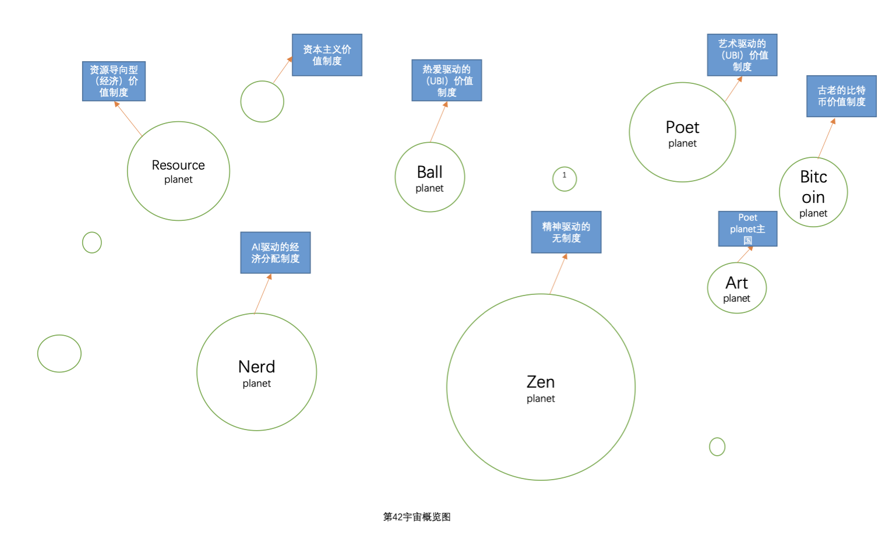

# 简介

&#x20;      在第42宇宙，每个星球都有自己的价值系统，他们保留着自己的特色，并且每个人都可以做自己的选择。

&#x20;      但是在星际文明还不发达的时候，第42宇宙中也存在着各种各样的战争，后来星际旅行开始，在错综复杂的星球旅行中，不同的星球之间开始交流，各种不同的权力与文化也发生了严重的碰撞。

&#x20;      在经过席卷整个宇宙的第42宇宙大战之后，人们最终将每个人自己的权力从政府手中夺回到自己手上，从那以后，战争终于离开了第42宇宙，并且似乎永远都不会回来。

&#x20;       在42宇宙有很多不同的星球，各个星球都各有特点，他们有自己的生活方式，也有自己的不同社会制度，在42宇宙不同的社会制度之间是相互和谐的，并且任何人可以选择自己的社会制度，并且随时都可以更换。

&#x20;      下面我将会介绍这个宇宙中各个星球与他们的故事，其中也会描述一场重要的第42宇宙大战。

